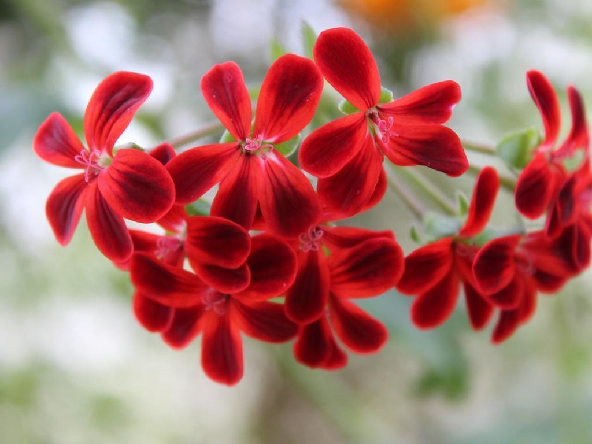
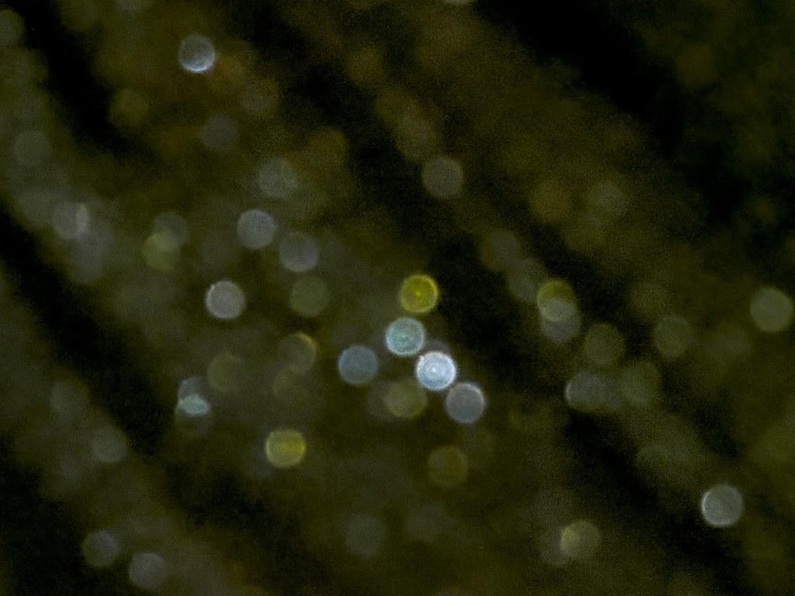

# 🌟 [MMP-2K: A BENCHMARK MULTI-LABELED MACRO PHOTOGRAPHY IMAGE QUALITY ASSESSMENT DATABASE] 🌟

---

# 💌 [**Supplementary document**](https://github.com/MMP-2k/MMP-2k/blob/main/supplementary.md) 💌

---

## ✨**Overview**
#### 📚 Official Repository for:
 MMP-2K: A BENCHMARK MULTI-LABELED MACRO PHOTOGRAPHY IMAGE QUALITY ASSESSMENT DATABASE  

#### ✒️ **Authors**  
##### TO BE RELEASED

This paper is submitted to [IEEE International Conference on Image Processing, IEEE ICIP 2025](https://2025.ieeeicip.org/).

***MMP-2k*** is a novel benchmark Image Quality Assessment (IQA) database for Macro Photography (MP) images. Each image within MMP-2k has a MOS and a quality report consisting of an overall quality description and distortion annotations.

---

## 🌐 **Content**
- 📖 **Showcase**: Example images in the MMP-2k database.
- 🚀  **Download**: Design details and usage instructions.
- 🔜 **TODO**: Upcoming changes.
- 👀 **Acknowledgement**: More things you need to know.

---

## 📖 **Showcases**
### FOR MORE DETAIL REGARDING MMP-2k DATABASE, PLEASE REDFER TO [HUGGINGFACE](https://huggingface.co/datasets/MMP-2k/MMP-2k)
<table>
  <tr>
    <td>
      
    </td>
    <td style="padding-left: 20px; vertical-align: top;">
      
<b>MOS:</b> 88.24

      
The image is excellent in quality.

    </td>
  </tr>
  <tr>
    <td>
      
    </td>
    <td style="padding-left: 20px; vertical-align: top;">
      
<b>MOS:</b> 69.12

      
The image is good in quality.

      
There is medium out of focus in the center.

    </td>
  </tr>
  <tr>
    <td>
      
    </td>
    <td style="padding-left: 20px; vertical-align: top;">
      
<b>MOS:</b> 54.41

      
The image is fair in quality.

      
There is mild underexposure in the entire image.

      
There is medium out of focus in the center bottom.

    </td>
  </tr>
  <tr>
    <td>
      
    </td>
    <td style="padding-left: 20px; vertical-align: top;">
      
<b>MOS:</b> 36.76

      
The image is poor in quality.

      
There is mild out of focus in the center.

       
There is medium out of focus in the bottom.

      
There is mild overexposure in the center.

    </td>
  </tr>
  <tr>
    <td>
      
    </td>
    <td style="padding-left: 20px; vertical-align: top;">
      
<b>MOS:</b> 1.47

      
The image is bad in quality.

      
There is strong noise and artifact in the entire image.

      
There is mild underexposure in the entire image.

      
There is strong out of focus in the entire image.

    </td>
  </tr>
</table>

## 🚀 **Download**

#### Option 1: Download the MMP-2k database from [GitHub Releases v1.0.0](https://github.com/MMP-2k/MMP-2k/releases/tag/v1.0.0).

#### Option 2: Download the MMP-2k database from [Hugging Face](https://huggingface.co/datasets/MMP-2k/MMP-2k).

---

## 🔜 **TODO**
#### ~~Build offical github repository~~
#### ~~Release samples on github repository~~
#### ~~Release samples on huggingface~~
#### ~~Release the MMP-2k with MOSs and quality reports on huggingface and github~~

---
## **Acknowledgement**
📬 Contact
For questions, feel free to contact us at this email:
Thanks for visiting! If you find this project helpful, consider giving it a ⭐ and cite!
BieTex:

This dataset is licensed under the Creative Commons Attribution-NonCommercial-ShareAlike 4.0 International License (CC BY-NC-SA 4.0).
You are free to share and adapt this dataset, provided that you give appropriate credit, use it only for non-commercial purposes, and distribute your contributions under the same license.

License details: https://creativecommons.org/licenses/by-nc-sa/4.0/
Attribution: [MMP-2k].

  

