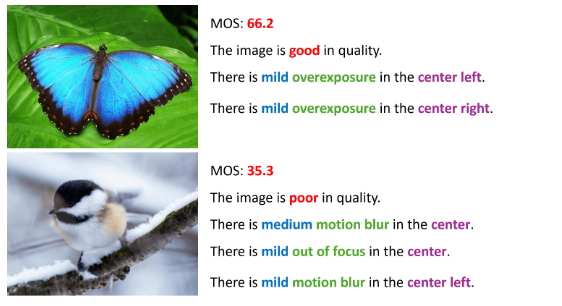

# 🌟 [MMP-2K: A BENCHMARK MULTI-LABELED MACRO PHOTOGRAPHY IMAGE QUALITY ASSESSMENT DATABASE] 🌟

---

# 💌 [**Supplementary document**](https://github.com/MMP-2k/MMP-2k/blob/main/supplementary.md) 💌

---

## ✨**Overview**
#### 📚 Official Repository for:
 MMP-2K: A BENCHMARK MULTI-LABELED MACRO PHOTOGRAPHY IMAGE QUALITY ASSESSMENT DATABASE  

#### ✒️ **Authors**  
##### TO BE RELEASED

This paper is submitted to [IEEE International Conference on Image Processing, IEEE ICIP 2025](https://2025.ieeeicip.org/).

***MMP-2k*** is a novel benchmark Image Quality Assessment (IQA) database for Macro Photography (MP) images. Each image within MMP-2k has a MOS and a quality report consisting of an overall quality description and distortion annotations.

---

## 🌐 **Content**
- 📖 **Showcase**: Example images in the MMP-2k database.
- 🚀  **Download**: Design details and usage instructions.
- 🔜 **TODO**: Upcoming changes.
- 👀 **Acknowledgement**: More things you need to know.

---

## 📖 **Showcases**
### FOR MORE DETAIL REGARDING MMP-2k DATABASE, PLEASE REDFER TO [HUGGINGFACE](https://huggingface.co/datasets/MMP-2k/MMP-2k)

---

## 🚀 **Download**
#### Option1: Clone the repository.
#### Option2: Download the MMP-2k database from [huggingface](https://huggingface.co/datasets/MMP-2k/MMP-2k)

---

## 🔜 **TODO**
#### ~~Build offical github repository~~
#### ~~Release samples on github repository~~
#### ~~Release samples on huggingface~~
#### Release the MMP-2k with MOSs and quality reports on huggingface and github

---
## **Acknowledgement**
📬 Contact
For questions, feel free to contact us at this email:
Thanks for visiting! If you find this project helpful, consider giving it a ⭐ and cite!
BieTex:

This dataset is licensed under the Creative Commons Attribution-NonCommercial-ShareAlike 4.0 International License (CC BY-NC-SA 4.0).
You are free to share and adapt this dataset, provided that you give appropriate credit, use it only for non-commercial purposes, and distribute your contributions under the same license.

License details: https://creativecommons.org/licenses/by-nc-sa/4.0/
Attribution: [MMP-2k].

  

